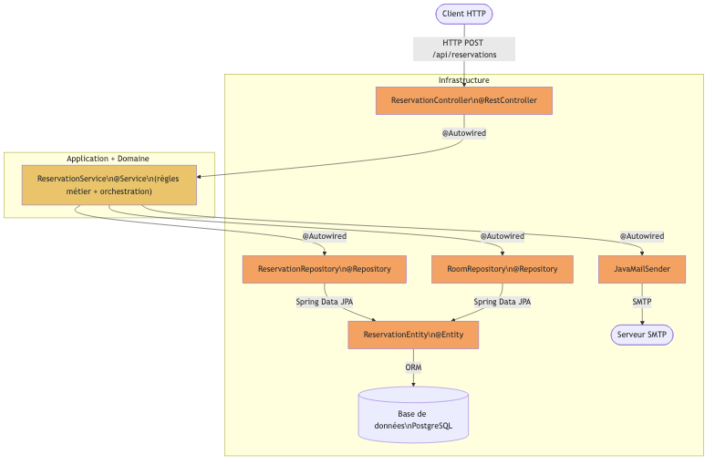
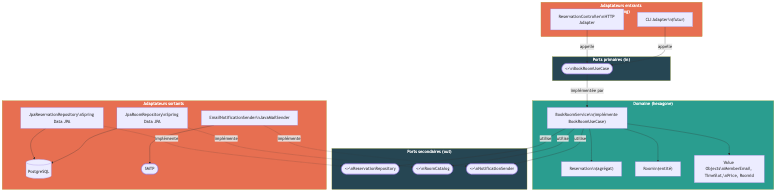
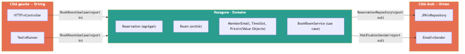

# Solution — Exercice 1 : Identifier le domaine dans un monolithe

> Système : plateforme de réservation de salles de réunion (co-working)

---

## 1. Tableau de classification Domaine / Application / Infrastructure

| Élément du code | Couche | Justification |
|---|---|---|
| Règle : email du membre obligatoire | **Domaine** | Invariant métier, indépendant de toute techno |
| Règle : durée minimale 30 min | **Domaine** | Règle métier pure |
| Règle : durée maximale 8h | **Domaine** | Règle métier pure |
| Règle : capacité de la salle ≥ nombre de participants | **Domaine** | Invariant métier |
| Règle : pas de chevauchement de créneaux | **Domaine** | Invariant métier de la réservation |
| Calcul du tarif (taux horaire × durée) | **Domaine** | Logique de pricing métier |
| Majoration de 20% le week-end | **Domaine** | Règle tarifaire métier |
| `ReservationService.bookRoom()` (orchestration) | **Application** | Coordonne le domaine et l'infrastructure, sans logique métier propre |
| `ReservationController` | **Infrastructure** | Adaptateur HTTP entrant (driving adapter) |
| `@RestController`, `@RequestMapping`, `@PostMapping` | **Infrastructure** | Annotations Spring MVC |
| `@Autowired` | **Infrastructure** | Injection de dépendances Spring |
| `@Service`, `@Transactional` | **Infrastructure** | Annotations Spring |
| `ReservationRepository` (interface Spring Data) | **Infrastructure** | Adaptateur de persistance |
| `RoomRepository` (interface Spring Data) | **Infrastructure** | Adaptateur de persistance |
| `ReservationEntity` + annotations JPA | **Infrastructure** | Modèle de persistance JPA |
| `@Entity`, `@Table`, `@ManyToOne`, `@Id`, `@GeneratedValue` | **Infrastructure** | Annotations JPA |
| `JavaMailSender` + `SimpleMailMessage` | **Infrastructure** | Adaptateur d'envoi d'email |
| `ReservationDTO` | **Application** | Objet de transfert entre couches |
| `BookRoomRequest` | **Application** | Commande entrante (input du use case) |

---

## 2. Règles métier identifiées

1. **Une réservation nécessite un email de membre valide** — sans email, impossible d'identifier le demandeur ni d'envoyer la confirmation.
2. **La durée minimale d'une réservation est 30 minutes** — en dessous, la réservation n'est pas pertinente.
3. **La durée maximale d'une réservation est 8 heures** — au-delà, une autre formule tarifaire s'applique (hors scope ici).
4. **La salle doit avoir une capacité suffisante** — le nombre de participants ne peut pas dépasser la capacité déclarée de la salle.
5. **Deux réservations ne peuvent pas se chevaucher sur la même salle** — une salle ne peut être qu'à un seul endroit à la fois.
6. **Le tarif est calculé au prorata horaire** — prix = taux horaire de la salle × durée en heures.
7. **Une majoration de 20% s'applique le week-end** — samedi et dimanche sont facturés plus cher.

---

## 3. Diagramme de dépendances actuel

Architecture en couches traditionnelle — les dépendances coulent de haut en bas, le domaine n'existe pas en tant que couche distincte, il est noyé dans le service.

**Problème clé :** toutes les flèches convergent vers le centre (le service), qui dépend directement des détails techniques (JPA, SMTP). Le "domaine" n'est pas isolé — il est couplé à l'infrastructure.

---

## 4. Diagramme cible en architecture hexagonale

### Vue des dépendances inversées

### Vue hexagonale (schéma concentrique)

---

## 5. Pourquoi l'architecture actuelle pose problème pour les tests

**Couplage fort à la base de données** : le `ReservationService` dépend directement de `ReservationRepository` et `RoomRepository`, qui sont des interfaces Spring Data JPA. Pour tester la règle "pas de chevauchement de créneaux", il faut obligatoirement démarrer un contexte Spring et une base de données — ce qui rend le test lent (plusieurs secondes vs quelques millisecondes) et fragile (état de la base entre les tests).

**Couplage au serveur SMTP** : la logique d'envoi d'email est directement dans le service. Sans mocker `JavaMailSender`, tout test de `bookRoom()` tentera d'envoyer un vrai email. Cela oblige à utiliser des mocks (Mockito) pour les tests unitaires, ce qui rend les tests moins fiables car ils vérifient des interactions, pas des comportements métier.

**Impossibilité de tester le domaine seul** : les règles métier (durée, capacité, chevauchement, tarification week-end) sont mélangées avec le code d'orchestration et d'infrastructure dans une seule classe. Il est impossible d'exécuter uniquement la logique de calcul de prix sans instancier tout le contexte Spring.

En architecture hexagonale, ces règles métier vivent dans des objets du domaine purs (sans annotations, sans dépendances externes) qui peuvent être testés en **millisecondes**, avec du Java pur, sans aucune infrastructure.
